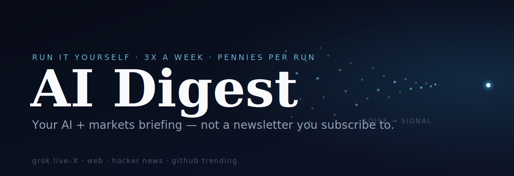

# AI Digest

**A twice-weekly, personalized AI + markets briefing you run yourself — not a newsletter you subscribe to.**

Most AI newsletters stop at headlines and treat everyone the same. This is a self-run [Claude Code](https://www.anthropic.com/claude-code) skill that scans the frontier the way *you'd* scan it — model releases, what builders are actually shipping, a GitHub scout tuned to your interests — and pairs it with a markets/deals/careers half, so you get one briefing that covers both the cutting edge and the business world around it.

It leans on **[Grok](https://x.ai)** for a live read of X (the only frontier model grounded on live posts), plus web search, **Hacker News**, and **GitHub / Hugging Face trending**. You bring your own API key; nothing is hosted, nothing is shared, and it costs pennies per run.

---

## What's in it

Two deliberately-separated halves so builder signal never gets diluted by business coverage:

**Part A — Frontier & Builders**
- New model releases & major capability updates
- What AI-native builders are shipping/debating (live-X via Grok + web + Hacker News + a watchlist you edit)
- A personalized GitHub + Hugging Face trending scout, ranked by relevance to *you*
- Notable AI funding / partnerships / regulation

**Part B — Markets, Deals & Careers**
- Consulting & strategy (MBB and top firms)
- Macro & investment trends
- Capital markets & M&A / VC deal flow
- Careers in the tracks you care about
- The established, funded AI stack (infra, chips, model providers)

---

## Setup (~5 minutes)

1. **Install [Claude Code](https://docs.anthropic.com/claude-code)** (the CLI or desktop app).
2. **Add this as a skill.** Clone the repo into your Claude Code skills directory, or drop `SKILL.md` into a skill folder:
   ```bash
   git clone https://github.com/bakulbadwal/ai-digest.git ~/.claude/skills/ai-digest
   ```
3. **(Optional but recommended) Add a Grok key** for the live-X pass. Get one at [x.ai](https://x.ai/api), then add a line to `~/.claude/.env`:
   ```
   XAI_API_KEY=xai-...
   ```
   Keep that file private (`chmod 600 ~/.claude/.env`). No key? The digest still runs on web search alone — the Grok pass just makes it sharper.
4. **Customize `SKILL.md`** — the watchlist, GitHub-scout target, and interest areas are a *template*. Edit the bits in `[brackets]` to your own accounts, GitHub profile, and the career/market categories you actually care about. This is the whole point: it's *your* digest.

## Running it

- **On demand:** just ask Claude Code to *"run the ai-digest skill"* (or invoke it by name).
- **On a schedule:** wire it to a Claude Code scheduled task / routine (e.g. Tue/Thu/Sat mornings). It only needs to run while your machine is awake.

The Grok pass can also be run standalone:
```bash
python3 scripts/grok-x-pass.py --days 4 \
  --prompt "What are top AI-native builders and tech leaders shipping/debating on X?"
```

---

## Design notes

- **Personalized, not a broadcast.** The value is that it's tuned to one reader — edit the template and it reads your world, not a generic feed.
- **Bring-your-own-key, self-hosted.** No backend, no subscription, no data leaving your machine. You own it and it costs cents per run.
- **Grok is the live-X layer, not a hard dependency.** It's the freshest signal, but the digest degrades gracefully to web-search-only if you skip the key.
- **Two halves on purpose.** Frontier/builder signal and business/markets signal want different sources and a different lens; blending them dulls both.

## Files

| File | What it is |
|---|---|
| `SKILL.md` | The digest skill — edit the templated watchlists/targets to your interests |
| `scripts/grok-x-pass.py` | Standalone live-X read via the xAI Grok API (reads `XAI_API_KEY` from env / `~/.claude/.env`) |
| `.env.example` | Template for your API key |

## License

MIT — see [LICENSE](LICENSE). Use it, fork it, make it yours.

---

*Built by [Bakul Badwal](https://github.com/bakulbadwal) — MBA Candidate, UVA Darden '27 — with Claude Code. Shared as a template for anyone who'd rather run their own briefing than read someone else's.*
