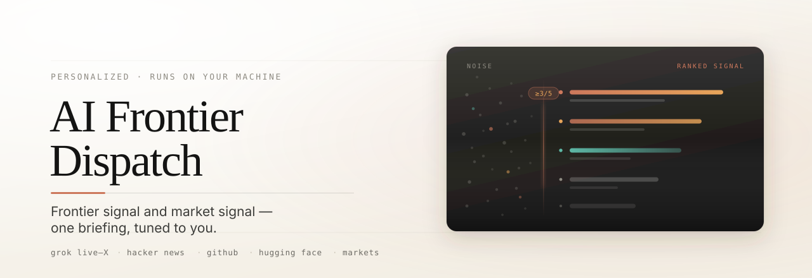

# AI Digest

[](LICENSE)
[](https://code.claude.com/docs/en/skills)

**A personalized AI + markets briefing, three times a week, that you run yourself — not a newsletter you subscribe to.**

Most AI newsletters stop at headlines and treat every reader the same. This is a self-run [Claude Code](https://www.anthropic.com/claude-code) skill that scans the frontier the way *you'd* scan it — model releases, what builders are actually shipping, a GitHub scout tuned to your interests — and pairs it with a markets/deals/careers half, so one briefing covers both the cutting edge and the business world around it.

It leans on **[Grok](https://x.ai)** for a live read of X (the only frontier model grounded on live posts), plus web search, **Hacker News**, and **GitHub / Hugging Face** trending. You bring your own API key; nothing is hosted, nothing is shared, and it costs pennies per run.

### 👉 [**Read a real sample digest →**](examples/sample-digest.md)

Actual unedited output from a single run. Worth 60 seconds before you install anything.

---

## What's in it

Two deliberately-separated halves, so builder signal never gets diluted by business coverage:

| Part A — Frontier & Builders | Part B — Markets, Deals & Careers |
|---|---|
| New model releases & capability updates | Consulting & strategy (MBB and top firms) |
| What AI-native builders are shipping/debating | Macro & investment trends |
| Personalized GitHub + Hugging Face scout | Capital markets & M&A / VC deal flow |
| AI funding, partnerships, regulation | Careers in the track you care about |
| | The established, funded AI stack |
| | A compact market pulse + optional thesis watch |

**What makes it different from a news feed:**

- **A relevance filter that knows who you are.** Every candidate is scored on recency, relevance-to-*you*, and substance before a single word gets written. Low scorers are dropped silently.
- **Source discipline.** AI-news search results are polluted with content farms that invent plausible specifics. The skill corroborates before asserting, labels anything single-sourced as unverified, distrusts star counts and engagement metrics as quality signals, and is instructed to say *"nothing new this window"* rather than pad a section.
- **Cost tiering built in.** Research fan-out runs on a mid-tier model; only the synthesis uses your best one. That's most of the bill, and it's the difference between a sustainable habit and an expensive novelty.

---

## Install

**Option A — as a plugin (recommended, no file wrangling):**

```bash
/plugin marketplace add bakulbadwal/ai-digest
```
```bash
/plugin install ai-digest
```

Run those from inside Claude Code. Then invoke it with `/ai-digest`.

**Option B — as a local skill (if you'd rather just clone it):**

```bash
git clone https://github.com/bakulbadwal/ai-digest.git ~/.claude/skills/ai-digest
```

**Option C — try it without installing:**

```bash
claude --plugin-dir /path/to/ai-digest
```

---

## Setup (~5 minutes)

**1. Add a Grok key** *(optional but recommended)* — this is the live-X layer. Get one at [x.ai/api](https://x.ai/api), then add a line to `~/.claude/.env`:

```
XAI_API_KEY=xai-...
```

Keep that file private (`chmod 600 ~/.claude/.env`). No key? The digest still runs on web search alone — the Grok pass just makes it sharper.

**2. Customize the config block.** Open `SKILL.md` and edit the single `⚙️ CONFIGURE THIS FIRST` block at the top. Everything personal lives there:

- [ ] `reader_profile` — **the most important field.** 1-3 specific sentences about your role and what you're building/hiring/investing for. This drives the entire relevance filter. Vague profile → generic digest.
- [ ] `watchlist` — who you actually want to track. Prune aggressively; a shorter list rotated well beats a long one.
- [ ] `github_profile` + `interest_areas` — tunes the repo scout.
- [ ] `career_track` — the roles you want news about.
- [ ] `never_recommend` — topics you've already settled, so it stops re-suggesting them.
- [ ] `thesis_watch` *(optional)* — one claim you hold, with baseline numbers. Turns a news feed into a position you're actively testing. The highest-value section if you use it.

**3. Run it once** and tune. The first run tells you fast whether your `reader_profile` is specific enough.

---

## Running it

- **On demand:** `/ai-digest`, or just ask Claude Code to *"run my digest."*
- **On a schedule:** wire it to a Claude Code scheduled task (e.g. Tue/Thu/Sat mornings). It only needs your machine awake.

The Grok pass also runs standalone:

```bash
python3 scripts/grok-x-pass.py --days 3 --prompt "What are top AI-native builders and tech leaders shipping/debating on X?"
```

---

## Design notes

- **Personalized, not a broadcast.** The value is that it's tuned to one reader. Edit the config and it reads your world, not a generic feed.
- **Bring-your-own-key, self-hosted.** No backend, no subscription, no data leaving your machine.
- **Grok is the live-X layer, not a hard dependency.** Freshest signal available, but the digest degrades gracefully to web-search-only.
- **Two halves on purpose.** Frontier/builder signal and business/markets signal want different sources and a different lens; blending them dulls both.
- **Honest failure beats padding.** A section that says "quiet this window" is doing its job. Most digest tools would rather fabricate than admit a slow news cycle.

## Files

| File | What it is |
|---|---|
| `SKILL.md` | The skill — edit the config block at the top to make it yours |
| `examples/sample-digest.md` | A real, unedited run — see the output before you commit |
| `scripts/grok-x-pass.py` | Standalone live-X read via the xAI Grok API |
| `.claude-plugin/` | Plugin + marketplace manifests (enables the one-line install) |
| `.env.example` | Template for your API key |

## License

MIT — see [LICENSE](LICENSE). Use it, fork it, make it yours.

---

*Built by [Bakul Badwal](https://github.com/bakulbadwal) — MBA Candidate, UVA Darden '27 — with Claude Code. Shared as a template for anyone who'd rather run their own briefing than read someone else's.*
